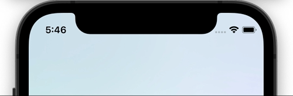

# react-native-toaster

Animated toast message component for React Native.



## Features

- 🚀 Strongly typed
- 🎨 Customizable layouts
- 🔧 Flexible config

## Install

```sh
# add to package.json
"react-native-toaster": "sergeymild/react-native-toaster#0.2.1"
```

## Usage

Render the `ToastRoot` component in your app's entry file, as the **LAST CHILD** in the `View` hierarchy (along with any other components that might be rendered there):

```js
// App.jsx
import { ToastRoot } from 'react-native-toaster';

export function App(props) {
  return (
    <>
      {/* ... */}
      <ToastRoot />
    </>
  );
}
```

Somewhere in app setup toast messages:
```js
// App.jsx
import { configureToasts } from 'react-native-toaster';

export const toastPresenter = configureToasts({
  // to have a nice autocompletion props must be the only one param in function 
  message: (props: { username: string; surname: string }) => {
    return (
      <View style={{ paddingTop: 54, backgroundColor: 'blue' }}>
        <Text>{props.username}</Text>
        <Text>{props.surname}</Text>
      </View>
    );
  },
  
  // to have a nice autocompletion props must be the only one param in function
  warning: (props: { message: string }) => {
    return (
      <View
        style={{
          marginTop: StatusBar.currentHeight ?? 56,
          backgroundColor: 'orange',
        }}
      >
        <Text children={props.message}/>
      </View>
    );
  },
});
```

Then use it anywhere in your app (even outside React components), by calling `toastPresenter` (which was returned from `configureToasts` method) directly:
```js
// Foo.jsx
import { Button } from 'react-native'

export function Foo(props) {
  const showToast = () => {
    toastPresenter({
      // here will be strongly typed key either 'message' or 'warning'
      key: 'warning',
      // depends of passed key here will be strongly typed params
      props: { message: 'warning' },
      // visible - means animation duration for show message
      // present - means animation duration for how long message will be displayed on screen
      // dismiss - means animation duration for how fast it will dissapear
      duration: { visible: 1000, present: 250, dismiss: 250 },
    });
  }

  return (
    <Button
      title='Show toast'
      onPress={showToast}
    />
  )
}
```

## Contributing

See the [contributing guide](CONTRIBUTING.md) to learn how to contribute to the repository and the development workflow.

## License

MIT

---

Made with [create-react-native-library](https://github.com/callstack/react-native-builder-bob)
